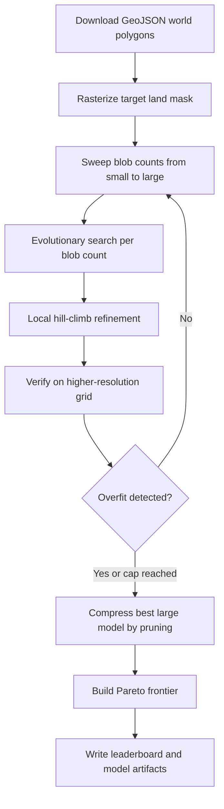

# MapGAN Implementation Guide

This document explains how MapGAN works, why it is built this way, and how to reason about its output.

The short version is this:

- The project turns the world map into a binary land mask.
- It represents that mask with a very small mathematical program: one bias term plus `N` wrapped, rotated Gaussian blobs.
- It searches across model sizes, refines each result locally, then compresses the strongest large model back down to find denser versions.
- It evaluates every hypothesis with ordinary classification metrics such as IoU and accuracy.

The result is not a coastline tracer or a neural network. It is a compact shape synthesizer that asks: how much of the world can we explain with a very small number of smooth primitives?

## Mental Model

Think of the algorithm as painting with soft, global airbrush strokes on a sphere.

- A positive blob adds land-like mass.
- A negative blob carves land away into ocean.
- The bias sets the default state of the whole planet before any blobs are applied.
- The final map is simply: `land if field > 0, ocean otherwise`.

At low parameter counts, the model behaves like a cartoon atlas. At higher counts, it becomes a sequence of broad corrections layered on top of one another.

## Why This Exists

The name sounds like a GAN, but the implementation deliberately is not one.

That is a design choice, not a missing feature.

The goal of this repo is not photorealistic geography. The goal is compressibility:

- Can we describe the world map with a tiny algorithm?
- Can we measure how much quality we gain per extra parameter?
- Can we expose a clear frontier between best quality and best density?

That pushes the implementation toward:

- deterministic geometry,
- compact parameter vectors,
- explicit scoring,
- systematic search,
- reproducible outputs.

## System Overview



## The Core Data Model

The central type is `Candidate` in [mapgan.py](mapgan.py). A candidate consists of:

- `bias`: one scalar applied everywhere.
- `blobs`: an array of shape `(N, 6)`.

Each blob stores six numbers:

1. `lon`: center longitude in degrees.
2. `lat`: center latitude in degrees.
3. `sx`: horizontal scale.
4. `sy`: vertical scale.
5. `angle`: rotation in radians.
6. `amp`: amplitude.

The parameter count is therefore:

$$
1 + 6N
$$

So:

- `0` blobs means `1` parameter.
- `6` blobs means `37` parameters.
- `8` blobs means `49` parameters.
- `24` blobs means `145` parameters.

This is why the leaderboard is interesting: every extra blob has a real cost.

## Step 1: Build the Target Map

The target comes from a public GeoJSON world dataset:

- default URL: `https://raw.githubusercontent.com/johan/world.geo.json/master/countries.geo.json`
- local cache: `data/countries.geo.json`

The implementation rasterizes those polygons into a binary land mask with `rasterize_target()`.

### Why Rasterize?

The solver wants a fixed rectangular grid so that:

- every candidate can be rendered quickly,
- metrics are easy to compute,
- search and verification resolutions can differ.

### Why the Triple-Width Canvas?

World polygons that cross the dateline are annoying on a plain `[-180, 180]` rectangle.

MapGAN solves this by drawing onto a canvas that is `3 * width` wide, then cropping the middle third. That allows dateline-crossing polygons to be shifted cleanly and still appear continuous after wrapping.

The steps are:

1. Convert each longitude/latitude vertex into pixel coordinates.
2. Detect whether the polygon crosses the dateline.
3. If it does, shift points near the left edge by one map width.
4. Draw the polygon three times: left copy, center copy, right copy.
5. Crop the center copy.

That is why GeoJSON wrapping stays stable even though the solver itself uses modular longitudes.

## Step 2: Create the Spherical Grid

`make_grid()` creates three arrays:

- `lon_grid`
- `lat_grid`
- `cos_lat`

The first two arrays store the world-space coordinate of every output pixel. The third matters because longitude distances shrink toward the poles.

Without `cos(lat)`, a blob would behave as if a degree of longitude had the same physical width everywhere, which is false on a sphere.

So the renderer uses:

$$
dx = \mathrm{wrap}(\lambda - \lambda_0) \cdot \cos(\phi)
$$

where:

- $\lambda$ is longitude,
- $\phi$ is latitude,
- `wrap` keeps longitudes inside `[-180, 180]`.

This is one of the small details that makes the output feel geographically plausible instead of warped.

## Step 3: Render a Candidate

`render_mask()` converts a candidate into a binary land mask.

The field starts at the bias value. Then each blob contributes a rotated Gaussian:

$$
f(x, y) = b + \sum_i a_i \exp\left(-\frac{1}{2}\left(\left(\frac{x'_i}{s_{x,i}}\right)^2 + \left(\frac{y'_i}{s_{y,i}}\right)^2\right)\right)
$$

where $x'_i$ and $y'_i$ are the rotated coordinates of the pixel relative to blob $i$.

After all blobs are accumulated:

$$
\text{land} = f(x, y) > 0
$$

That last threshold is the entire decoder.

### Why Gaussian Blobs?

They are useful because they are:

- smooth,
- differentiable in spirit even though the solver is not gradient-based,
- cheap to evaluate,
- expressive enough to represent large continental bands,
- simple enough to keep the parameter count honest.

### Why Positive and Negative Amplitudes?

Because the best compact maps often need both construction and subtraction.

A low-blob candidate may choose to start from mostly land and carve away oceans. Another may start from mostly ocean and add continents. Both are valid.

That is controlled by the interaction between `bias` and `amp`.

## Worked Example: The Current Dense Model

The current `best_dense` model in [out/best_dense.json](out/best_dense.json) has `8` blobs and `49` parameters.

Its bias is:

```json
{
  "bias": 0.820839209673727
}
```

That positive bias means the raw field starts above zero almost everywhere. In plain English: the model begins with a world that is mostly land, then uses strong negative blobs to carve out oceans.

Two examples from that file:

```json
{
  "lon": 108.02300262451172,
  "lat": 27.678241729736328,
  "sx": 95.0,
  "sy": 23.93152618408203,
  "angle_deg": -48.682262101725094,
  "amp": 1.9482462406158447
}
```

This is a broad positive stroke across Eurasia and nearby land mass. It is wide in longitude and moderate in latitude, which makes it useful as a continental backbone.

```json
{
  "lon": 175.84603881835938,
  "lat": 20.85653305053711,
  "sx": 26.786924362182617,
  "sy": 21.616809844970703,
  "angle_deg": -17.82706694130008,
  "amp": -2.802000045776367
}
```

This is a strong negative stroke near the Pacific edge. Because longitudes wrap, a blob near `176` degrees influences both sides of the map image. That makes it ideal for cutting ocean basins that span the dateline.

This combination is a good example of the model's behavior:

- one or two very large shapes establish a global story,
- several negative shapes carve away oceans,
- a few smaller local shapes correct mistakes.

## Step 4: Score the Map

`score_mask()` compares a candidate mask with the target mask.

It computes:

- IoU
- F1
- accuracy
- precision
- recall
- land fraction

### Why IoU Is the Main Score

Accuracy alone is too forgiving on sparse segmentation problems. A model can get a lot of ocean pixels correct and still be a bad world map.

IoU is more demanding because it cares directly about overlap:

$$
\mathrm{IoU} = \frac{TP}{TP + FP + FN}
$$

That makes it the main ranking metric throughout the search.

Accuracy is still useful as a sanity check, especially when comparing dense models that differ mostly along coastlines.

## Step 5: Search by Increasing Complexity

The sweep in `cmd_solve()` increases the blob count from `min_blobs` to `max_blobs`.

For each blob count, it runs `optimize()`.

That optimizer is a hybrid of three ideas:

1. warm start from the previous best candidate,
2. evolutionary mutation search,
3. local hill-climb refinement.

### Warm Start

When the solver moves from `N` blobs to `N + 1`, it keeps the old candidate and appends a random new blob.

Why?

Because the `N + 1` solution should usually look like the `N` solution plus one extra corrective shape. Starting from scratch would waste that structure.

### Evolutionary Search

`optimize()` creates a population of candidates.

Each generation:

1. renders every candidate,
2. scores it by IoU,
3. keeps the elites,
4. mutates copies of those elites,
5. injects a few random fresh candidates.

The mutation scale shrinks over time, so early generations explore broadly and later generations fine-tune.

This is not a true genetic algorithm with crossover. It is closer to a seeded evolutionary hill-climber.

### Why Random Injections Matter

Without them, the population can collapse into one family of shapes too early. Random new candidates act like escape hatches from local optima.

## Step 6: Local Refinement

After the evolutionary phase, `refine_candidate()` does a deterministic coordinate search.

It perturbs one parameter at a time:

- bias
- longitude
- latitude
- horizontal scale
- vertical scale
- angle
- amplitude

For each parameter it tries a positive and negative step. If either improves IoU, it keeps the change.

This is important because evolutionary search is good at finding the right neighborhood, but not always good at settling precisely onto the best coordinates inside that neighborhood.

### Why This Helped So Much

This refinement stage was the biggest quality jump in the project.

Before it, the solver could find plausible large-scale shapes but often left obvious slack in the parameters. After adding local refinement, verified quality rose sharply.

That happened because many candidates were already nearly right. They just needed a small shift in longitude, a slightly larger scale, or a bit more negative amplitude.

## Step 7: Verification and Overfit Detection

The solver does not only score on the search grid.

It uses two resolutions:

- search grid: `128 x 64`
- verification grid: `256 x 128`

This creates a basic generalization check:

- if a candidate only looks good on the coarse grid, it may not hold up on the finer grid,
- if verification keeps improving too, the extra complexity is probably real.

The leaderboard stores both scores and their gap:

$$
\text{generalization gap} = \text{search IoU} - \text{verify IoU}
$$

### The Overfit Rule

`maybe_detect_overfit()` stops the sweep if all of these are true:

1. the solver has already reached a minimum blob count,
2. verification has stagnated for several steps,
3. search IoU has still improved enough,
4. verified IoU has fallen enough.

In words: training keeps getting better, verification has clearly stopped agreeing, and that pattern is not just noise.

### Important Nuance

In the current reference run, overfit detection does not fire. The sweep reaches the hard cap at `48` blobs.

That does not mean the heuristic is unused. It means the direct sweep kept finding worthwhile verified improvements often enough that the stop condition never became true before the cap.

## Step 8: Compression

Compression is where the project becomes much more interesting.

After the forward sweep, the solver takes the strongest candidate it has seen and runs `compress_candidate()`.

Compression works like this:

1. take the current candidate,
2. try removing each blob one at a time,
3. locally refine each reduced candidate,
4. keep the removal that yields the best verified score,
5. repeat until the minimum blob count is reached.

### Why Compression Exists

Forward growth is asymmetric.

It is good at adding corrective structure, but once the search climbs into a rich high-blob solution, it may never rediscover the best smaller version on its own.

Compression fixes that by asking a different question:

> If I already know a strong large solution, which single blob is least essential?

That changes the search landscape completely.

### Concrete Example From the Current Run

This is the strongest single insight in the implementation:

- the direct sweep's best verified model reached about `0.6620` IoU at `43` blobs,
- the compression pass improved that to about `0.7032` IoU,
- and it did so with only `24` blobs.

So the large model was not the final answer. It was a scaffold that exposed a better smaller answer.

This is exactly why compression is part of the algorithm and not just a post-processing trick.

## Step 9: Build the Pareto Frontier

Once the solver has both:

- the forward sweep,
- the compression pass,

it merges them and sorts by parameter count.

`build_pareto_frontier()` keeps only rows whose verified IoU is strictly better than anything smaller seen before.

That produces the density frontier: the set of models where buying more parameters actually buys more verified quality.

### Best Overall vs Best Dense

The project intentionally saves two winners:

1. `best_overall`
2. `best_dense`

`best_overall` is simply the strongest verified model.

`best_dense` is the smallest frontier model whose verified IoU is at least:

$$
0.92 \times \text{best overall verified IoU}
$$

That threshold is controlled by `--dense-fraction`.

### Current Reference Results

As of the current reference leaderboard:

| Model | Blobs | Params | Verify Accuracy | Verify IoU | Meaning |
| --- | ---: | ---: | ---: | ---: | --- |
| `best_overall` | 24 | 145 | 0.8877 | 0.7032 | Strongest verified model after compression |
| `best_dense` | 8 | 49 | 0.8623 | 0.6479 | Smallest model within 92% of best-overall IoU |
| `compressed_06` | 6 | 37 | 0.8410 | 0.6130 | Same parameter budget as the old 6-blob winner, but much stronger |

That last row is especially important for intuition.

It shows that better search strategy can matter as much as better model family. The representation stayed the same. The solver got better.

## Why the Best Dense Model Is Useful

The overall winner is what you want if you care only about quality.

The dense winner is what you want if you care about elegance.

In this repo, both matter.

The dense model answers the more interesting question:

> How much world can I buy with a very small amount of code and data?

That is why `best_dense` is a first-class artifact and not just an afterthought.

## Output Artifacts

The solver writes several classes of files into `out/`:

- `target_*.png`: rasterized target masks.
- `best_XX.json`: best direct-sweep candidate at blob count `XX`.
- `best_XX_*.png`: preview image for that candidate.
- `best_XX_diff.png`: visual diff against the target.
- `compressed_XX.json`: best compressed candidate at blob count `XX`.
- `best_overall.json`: strongest verified candidate overall.
- `best_dense.json`: smallest near-best frontier candidate.
- `leaderboard.json`: full machine-readable report.

### How to Read the Diff Images

The diff images use a simple color code:

- dark background: ocean in both target and prediction,
- blue: target land that the model missed,
- orange: predicted land that should be ocean,
- light gray: overlap between target and prediction.

That makes it easy to tell whether a candidate is:

- overfilling oceans,
- missing continents,
- or broadly correct but coarse around boundaries.

## Reproducibility

The file [reproduce_leaderboard.sh](reproduce_leaderboard.sh) exists to recreate the current reference result set.

It pins:

- the package versions,
- the target URL,
- the target file checksum,
- the solver arguments,
- the expected summary metrics.

That script does four things:

1. installs the exact runtime,
2. refreshes and verifies the target map,
3. reruns the full solver,
4. asserts that the resulting metrics match the checked-in reference values.

The script also sets thread-count environment variables to reduce nondeterministic differences from native math libraries.

## Why the Implementation Is a Single Python File

This project deliberately keeps the core in one file: [mapgan.py](mapgan.py).

That has tradeoffs.

It is not the best structure for a large production system. But it is a good structure for a compact research toy because:

- the whole algorithm is visible at once,
- data flow is easy to trace,
- parameter experiments are easy to make,
- the implementation stays close to the idea.

For this repo, that clarity is worth more than architectural ceremony.

## Common Questions

### Why not use gradients?

The field is smooth, but the final thresholding and the search goals make the landscape awkward. A direct gradient-based optimizer would be more complex and would move the repo away from its "short algorithm" spirit.

The hybrid search used here is simpler to reason about and already strong enough to be interesting.

### Why not learn coastlines directly?

Because the project is about compressed explanation, not exact cartography. Coastlines are high-frequency detail. The model is intentionally low-frequency.

### Why is the bias sometimes positive?

Because "start from land and carve oceans" is a perfectly valid strategy when you have strong negative blobs available.

### Why does compression sometimes improve quality instead of merely preserving it?

Because the large model can act as a scaffold. Once it discovers the right broad arrangement, pruning and re-refining can remove redundant or counterproductive blobs and expose a cleaner smaller solution.

## How to Extend the Project Safely

If you want to evolve the implementation, these are the most natural directions.

### 1. Add New Primitive Families

Possible additions:

- plateau blobs,
- soft rectangles,
- radial basis functions with heavier tails,
- signed distance style primitives.

Do this if you want more expressive geometry per parameter.

### 2. Add Budget-Driven Search

Instead of sweeping all blob counts, expose a mode like:

- best model under 37 parameters,
- best model under 49 parameters.

This would fit the code-golf framing very well.

### 3. Add Better Verification Splits

Current verification uses higher resolution rather than a separate dataset. You could also verify on:

- held-out spatial masks,
- different rasterization resolutions,
- perturbed target masks.

### 4. Add Multi-Start Compression

Right now compression starts from the best direct-sweep solution. Starting from several large candidates could produce an even better frontier.

## If You Need to Read the Code in Order

The most useful reading order is:

1. `Candidate`
2. `rasterize_target()`
3. `render_mask()`
4. `score_mask()`
5. `optimize()`
6. `refine_candidate()`
7. `compress_candidate()`
8. `cmd_solve()`

That sequence mirrors the idea flow from representation to search to output.

## Final Intuition

MapGAN works because it turns the world map into a contest between three forces:

- expressiveness: more blobs can explain more structure,
- discipline: fewer parameters are cleaner and more elegant,
- verification: only improvements that survive a stricter view really count.

The implementation is essentially a compression engine for geography.

It does not ask, "Can I draw the world map?"

It asks, "How little machinery do I need before the world starts to appear?"