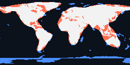

# mapgan

MapGAN is a deliberately tiny world-map approximator.

It does not try to reproduce coastlines directly. Instead, it treats the land mask as a hypothesis made from a small number of rotated, wrapped Gaussian blobs on an equirectangular grid. The solver sweeps from simpler to more complex hypotheses, locally refines the best candidate at each size, then compresses the strongest large model back downward to find denser approximations.

## TL;DR

Current checked-in best overall result:

- `24` blobs
- `145` parameters
- verified accuracy `0.8877`
- verified IoU `0.7032`



For a full implementation walkthrough, see [IMPLEMENTATION.md](IMPLEMENTATION.md).

Search happens on a coarser grid. Verification happens on a higher-resolution grid. That gives the project an explicit overfit signal: if the coarse-grid score keeps improving while the verified score stops improving and begins to fall, the sweep can stop automatically.

## What it does

- Downloads a public world-country GeoJSON and rasterizes it into a land mask.
- Searches for a compact approximation using `N` blobs plus one bias term.
- Refines each winning candidate with a coordinate hill-climb.
- Compresses the strongest large model by pruning blobs and re-refining, which improves both score and density.
- Measures each hypothesis with IoU, F1, accuracy, precision, and recall.
- Verifies each complexity on a higher-resolution raster and can stop automatically on overfit.
- Saves preview images, diff images, JSON model files, and a Pareto-style dense frontier into `out/`.

## Install

```bash
/home/t/PycharmProjects/mapgan/.venv/bin/python -m pip install -r requirements.txt
```

## Run

Fetch and rasterize a target map:

```bash
/home/t/PycharmProjects/mapgan/.venv/bin/python mapgan.py fetch-target --width 256 --height 128
```

Run the systematic hypothesis sweep until overfit is detected or the hard cap is reached:

```bash
/home/t/PycharmProjects/mapgan/.venv/bin/python mapgan.py solve --min-blobs 0 --max-blobs 48 --population 48 --steps 24
```

Reproduce the full current leaderboard, best-overall model, and best-dense model with pinned inputs and metric checks:

```bash
./reproduce_leaderboard.sh
```

Verify a saved model explicitly:

```bash
/home/t/PycharmProjects/mapgan/.venv/bin/python mapgan.py verify --model out/best_overall.json --width 256 --height 128
```

## Notes

- The target data source defaults to `https://raw.githubusercontent.com/johan/world.geo.json/master/countries.geo.json`.
- “Shortest possible algorithm” is represented here by hypothesis complexity: fewer blobs means fewer parameters.
- There is no required threshold. The leaderboard is the point.
- Overfit detection compares the best verified IoU seen so far against later blob counts. By default, the sweep stops when the search-grid IoU keeps improving, the verified IoU has dropped by at least `0.003`, and that pattern has persisted for `4` consecutive blob counts after at least `6` blobs.
- If you want a pure fixed-range sweep, run `mapgan.py solve --no-stop-on-overfit`.
- `out/best_overall.json` is the strongest verified model found after sweep plus compression.
- `out/target_256x128.png` is the checked-in verification target image, so others can compare against the canonical target without regenerating it first.
- `out/best_dense.json` is the smallest model on the Pareto frontier that still retains at least `92%` of the best verified IoU.
- `out/leaderboard.json` now includes the raw sweep, the compression pass, and the Pareto frontier summary.
- `reproduce_leaderboard.sh` pins the package versions, validates the downloaded GeoJSON checksum, reruns the full sweep, verifies the saved winners, and checks that the summary metrics match the current reference result.
- `data/countries.geo.json`, `out/target_256x128.png`, and `out/best_overall.*` are checked into the repo as the reference input and showcase artifacts.